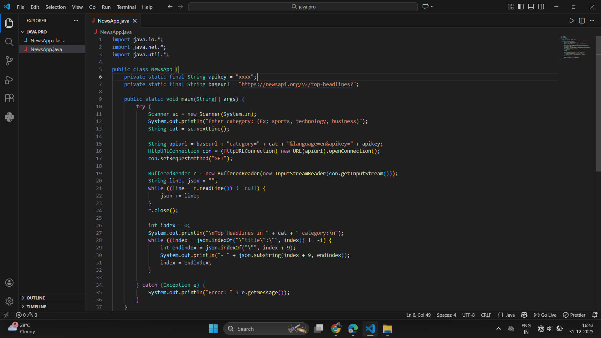
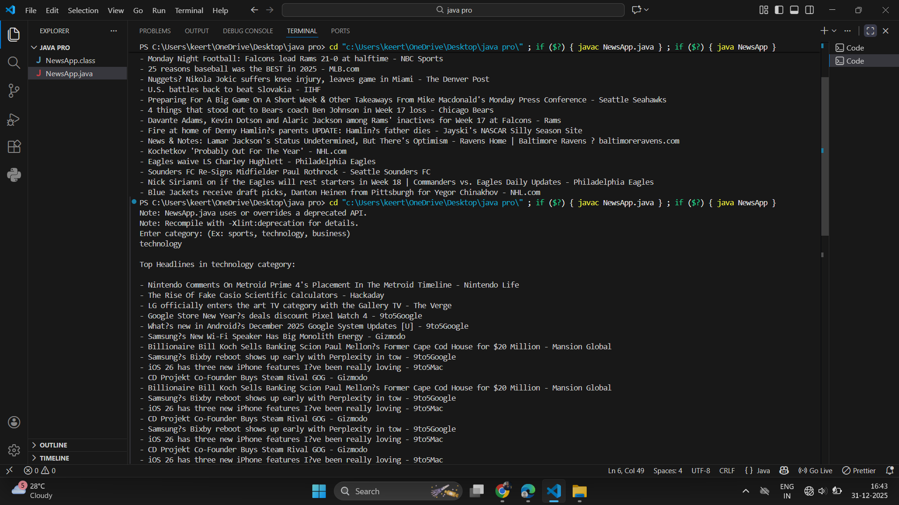
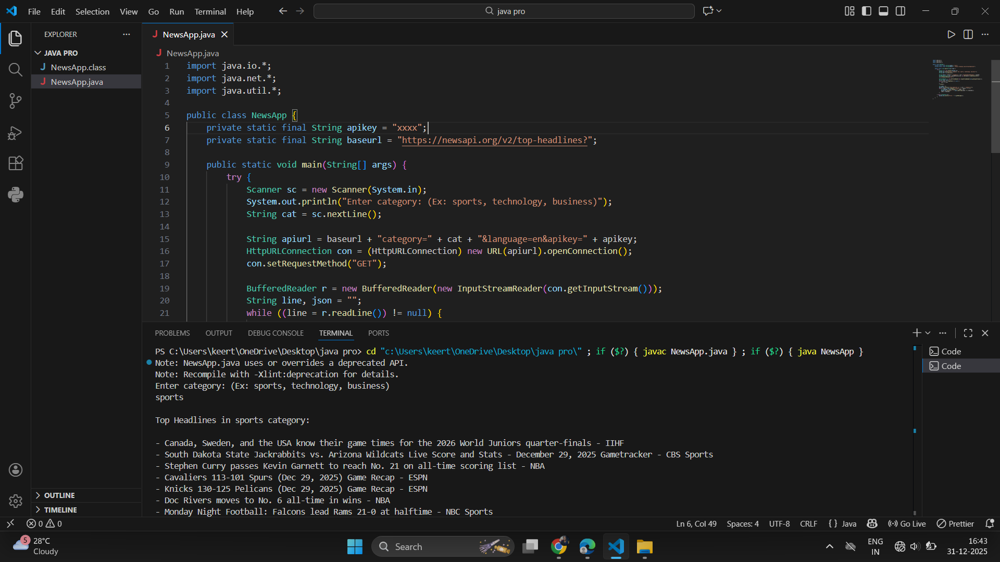

# NEWSAPP

## Project Overview
NEWSAPP is a Java-based application that fetches and displays the latest news updates dynamically. 
This project helped me strengthen my Java skills and understand API integration.

## Features
- Fetches news from a news API
- Displays news in a user-friendly format
- Easy to run and understand

## Screenshots





## How to Run
1. Clone this repository
2. Compile the Java files using:
   ```bash
   javac NewsApp.java
   
3. Run the program using:
     java NewsApp
4. Replace XXXX in the API key placeholder with your own API key
 ## Technologies Used
     Java
     JSON (API handling)
## Author
Dhandapanikeerthana
